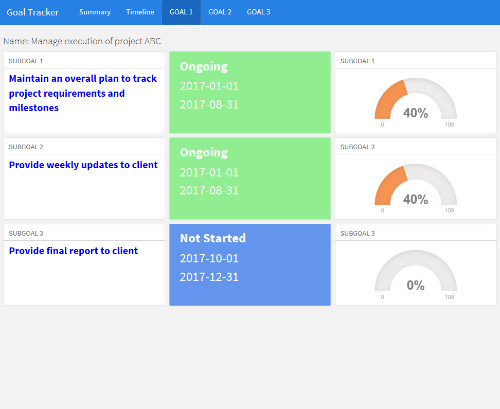

# goalTracker

goalTracker is a combined shiny app and flexdashboard which allows easy tracking and updating of goals.

## Structure

This goal tracking structure is defined by a series of main goals, each of which can contain a number of subgoals.  The subgoals can be timebound, in which a start and end date are required, or not.  They can also be tagged as *new* or *priority* and have an associated percent completed.

All data are stored in a sqlite database (for local storage) or a mysql database (for local or connected storage).  The shiny app is set to run with a local sqlite database but also contains code for connecting to a mysql database (commented out).

## Shiny App

The purpose of the shiny app is to provide a framework to enter data on goals and update their progress.  It's a very simple app which presents the user with two tables containing main goals and subgoals.

## flexdashboard

The flexdashboard provides a tabbed view of the database.  The Summary tab displays a view of each main goal with the progress for each of their subgoals.  Tooltips provide subgoal details.  The Timeline tab illustrates a colored timeline for each goal.  Additional tabs provide further detail for each main goal

## Use

I use this to track my work-related goals via RStudio Connect.  Both the shiny app and  flexdashboard markdown reside on RStudio Connect and connect to a database residing on an external server (*libmysqlclient* must be installed on the server running RStudio Connect).  Working in this way, I can run a daily update of the flexdashboard to display any progress or changes made to the goals - it becomes almost realtime tracking.  Unfortunately much of our systems are locked down but there's no reason why the database could not be updated via email using an agent such as procmail.

## Limitations

Currently this is limited to a single user but it could easily be adapted to allow multiple users simply by adding an additional database field along with some authentication.

## Still to do

-  Polish up the shiny app a little
-  Allow updates from the flexdashboard
